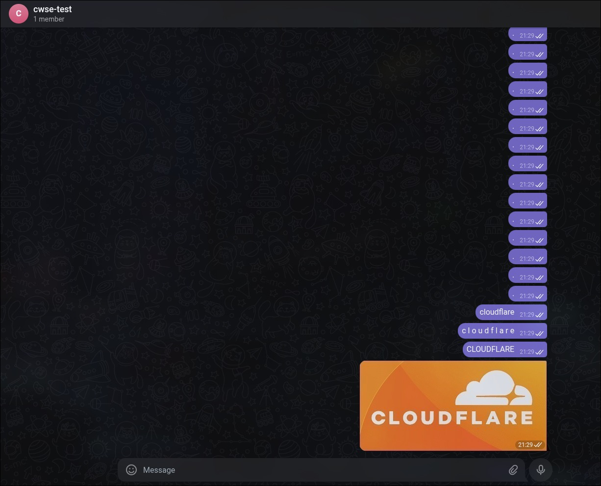
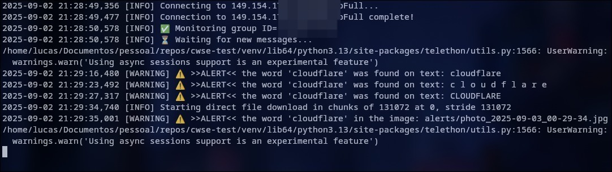
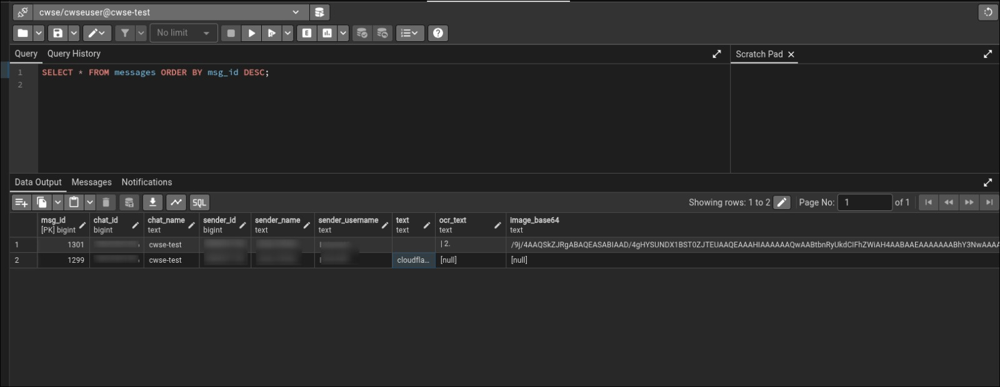

-----

# CWSE-TEST

This repository contains a **Proof of Concept (PoC)** for security automation. The application monitors a specified Telegram group for a keyword, searching both text messages and text within images (using OCR). When the keyword is found, metadata about the message, sender, and media is stored in a PostgreSQL database.

## Running with Docker

### Requirements

  * Telegram API credentials (`api_id` and `api_hash`)
  * Telegram phone number
  * A Telegram group where your account is a member. **(It's recommended to create a new group for this PoC)**.
  * Docker and Docker Compose

-----

### 1\. Get Telegram Credentials

First, you'll need to obtain an `api_id` and `api_hash` from Telegram. You can do this by creating a new application on the [official Telegram website](https://my.telegram.org/).

  * For more details, see the official guide: [Obtaining your api\_id](https://core.telegram.org/api/obtaining_api_id)

-----

### 2\. Populate the `.env` File

Once you have your credentials, create a `.env` file in the project's root directory. Populate it with the following variables:

| Key | Configuration | Required | Example |
| :--- | :--- | :---: | :--- |
| `TL_API_ID` | Your application `api_id`. | ✅ | `12345678` |
| `TL_API_HASH` | Your application `api_hash`. | ✅ | `asdasdn2346sdbf23487yhsdbf347` |
| `PHONE` | The phone number for your Telegram account. | ✅ | `+5511999999999` |
| `GROUP_ID` | The ID of the group you want to monitor. | ✅ | `-1234356` |
| `KEYWORD` | The word you want to search for. | ✅ | `cloudflare` |
| `LOG_LEVEL` | The logging level for the application. | ❌ | `INFO`, `WARNING`, `ERROR`, `DEBUG` |
| `SESSION_FILE`| Path for the session file inside the container. | ❌ | `/app/session/example.session` |

📌 **Note**: If you don't know the `GROUP_ID`, you can leave it empty (`GROUP_ID=`) and set `LOG_LEVEL=DEBUG`. When you run the application for the first time, it will print the IDs of all the groups your account is in.

-----

### 3\. Build and Run the Container

With your `.env` file configured, run the following command. This will build the Docker image and start the container in interactive mode, which is necessary for the initial login.

```bash
docker compose run --build --rm -it cwse-test
```

> *Note: The interactive login is a security measure from the Telegram API for user accounts. Using a bot token (via BotFather) would likely bypass this step [I think...].*

-----

### 4\. Authenticate Your Session

The application will prompt you for your phone number. Enter it in the international format (e.g., `+5511999999999`).

Telegram will then send a login code to your device. Enter this code when prompted in the terminal.

-----

### 5\. Test the Application

Once authenticated, the application will start monitoring the group. To test it:

1.  Send a text message containing the `KEYWORD` you set in the `.env` file to the target group.
2.  Send an image that contains the `KEYWORD` as text within it.

You should see a log output in your terminal similar to this:
`[WARNING] ⚠️ >>ALERT<< the word 'cloudflare' was found on text: cloudflare`




3.  After app find the keyword on message the app is going to save on postgresql, you can check the database
using the following query:
> SELECT * FROM messages ORDER BY msg_id DESC;



-----

## References

  - [Telethon Documentation](https://docs.telethon.dev/en/stable/modules/client.html)
  - [Tesseract OCR](https://tesseract-ocr.github.io/)
